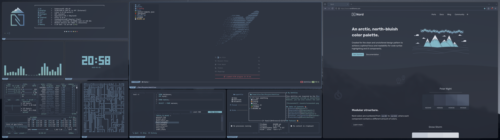

# My Dotfiles

This dotfiles are inspired by the [Nord Theme](https://www.nordtheme.com/), and are designed to be simple and easy to use.  
This repository include an installation script which will help you to install the configurations you want.  
However, you can also install the configurations manually.



## Table of Contents 📚
- [Features](#features-)
- [Requirements](#requirements-)
- [Installation](#installation-)
- [Documentation](#documentation-)
- [External configurations](#external-configurations-)
- [Contributing](#contributing-)

## Features 🎨

| **Name**  | **Configuration Folder**                                                                      |
|-----------|-----------------------------------------------------------------------------------------------|
| btop++    | [Configuration Folder](https://github.com/a-lebailly/dotfiles/tree/main/config/btop)          |
| cava      | [Configuration Folder](https://github.com/a-lebailly/dotfiles/tree/main/config/cava)          |
| fastfetch | [Configuration Folder](https://github.com/a-lebailly/dotfiles/tree/main/config/fastfetch)     |
| harlequin | [Configuration Folder](https://github.com/a-lebailly/dotfiles/tree/main/config/harlequin)     |
| hypr      | [Configuration Folder](https://github.com/a-lebailly/dotfiles/tree/main/config/hypr)          |
| kitty     | [Configuration Folder](https://github.com/a-lebailly/dotfiles/tree/main/config/kitty)         |
| pipe.sh   | [See documentation](#documentation-)                                                          |
| rofi      | [Configuration Folder](https://github.com/a-lebailly/dotfiles/tree/main/config/rofi)          |
| starship  | [Configuration Folder](https://github.com/a-lebailly/dotfiles/tree/main/config/starship.toml) |
| superfile | [Configuration Folder](https://github.com/a-lebailly/dotfiles/tree/main/config/superfile)     |
| tty-clock | [See documentation](#documentation-)                                                          |
| waybar    | [Configuration Folder](https://github.com/a-lebailly/dotfiles/tree/main/config/waybar)        |

*You can find many others external configuration based on Nord Theme [here](#external-configurations-).*

## Requirements 📦
| **Name**  | **Sources**                                          | **Requirements**                                                                                       |
|-----------|------------------------------------------------------|--------------------------------------------------------------------------------------------------------|
| btop++    | [GitHub](https://github.com/aristocratos/btop)       | *No requirements*                                                                                      |
| cava      | [GitHub](https://github.com/karlstav/cava)           | *No requirements*                                                                                      |
| fastfetch | [GitHub](https://github.com/fastfetch-cli/fastfetch) | `./assets/nord-theme.png`                                                                              |
| harlequin | [GitHub](https://github.com/tconbeer/harlequin)      | *No requirements*                                                                                      |
| hypr      | [GitHub](https://github.com/hyprwm/Hyprland)         | [Breeze Cursor](https://github.com/KDE/breeze/tree/master/cursors/Breeze) and `./assets/wallpaper.png` |
| kitty     | [GitHub](https://github.com/kovidgoyal/kitty)        | `./fonts/CaskaydiaCoveNerdFont`                                                                        |
| pipe.sh   | [GitHub](https://github.com/pipeseroni/pipes.sh)     | Kitty and its configuration                                                                            |
| rofi      | [GitHub](https://github.com/davatorium/rofi)         | `./fonts/UbuntuNerdFont`                                                                               |
| starship  | [GitHub](https://github.com/starship/starship)       | *No Requirements**                                                                                     |
| superfile | [GitHub](https://github.com/yorukot/superfile)       | *No requirements*                                                                                      |
| tty-clock | [GitHub](https://github.com/xorg62/tty-clock)        | Kitty and its configuration                                                                            |
| waybar    | [GitHub](https://github.com/Alexays/Waybar)          | `./fonts/UbuntuNerdFont`                                                                               |

## Installation 🚀
You can install the configurations using the automated installation script or manually.

### Clone the repository :
```bash
git clone https://github.com/a-lebailly/dotfiles.git && cd dotfiles
```

### Automated installation :  
The automated installation script will ask you which configuration you want to install.  
```bash
chmod +x install.sh
./install.sh
```

### Manual installation :  
To install manually all the configurations, you can use the following commands :
```bash
cp -r ./fonts/* ~/.local/share/fonts/
cp -r ./assets/* ~/.local/share/dotfiles/
cp -r ./config/* ~/.config/
```

To install a specific configuration, you can use the following commands :  
**Note**: Check the requirements before installing a specific configuration.
```bash 
# E.g. Install the kitty configuration
cp -r ./config/kitty ~/.config/
cp -r ./fonts/CaskaydiaCoveNerdFont ~/.local/share/fonts/
```

## Documentation 📖
- **pipe.sh**: Execute `pipes.sh -p 5 -c 4 -f 100` or add this alias to your `.bashrc` or `.zshrc` file.
   ```bash
   alias pipesh="pipes.sh -p 5 -c 4 -f 100"
   ```
- **rofi**: Execute `rofi -show drun -theme ~/.config/rofi/config.rasi` to open rofi and apply the style.
- **tty-clock**: Execute `tty-clock -c -C 6` or add this alias to your `.bashrc` or `.zshrc` file.
   ```bash
   alias clock="tty-clock -c -C 6"
   ```

## External configurations 🌐

| Name       | Configuration URL                                                              |
|------------|--------------------------------------------------------------------------------|
| firefox    | [Configuration URL](https://addons.mozilla.org/fr/firefox/addon/nord-firefox/) |
| obsidian   | [Configuration URL](https://github.com/insanum/obsidian_nord)                  |
| vim/neovim | [Configuration URL](https://github.com/nordtheme/vim)                          |
| jetbrains  | [Configuration URL](https://plugins.jetbrains.com/plugin/10321-nord)           |
| vscode     | [Configuration URL](https://github.com/nordtheme/visual-studio-code)           |

*You can find more ports of the Nord Theme [here](https://www.nordtheme.com/ports).*

## Contributing 🤝
Feel free to contribute to this project by opening an issue or a pull request.  
Before any contribution, please check the Nord Theme color palette [here](https://www.nordtheme.com/docs/colors-and-palettes).
