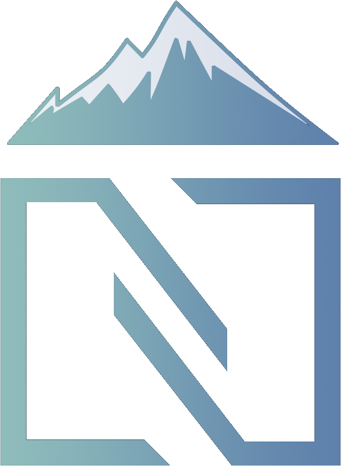
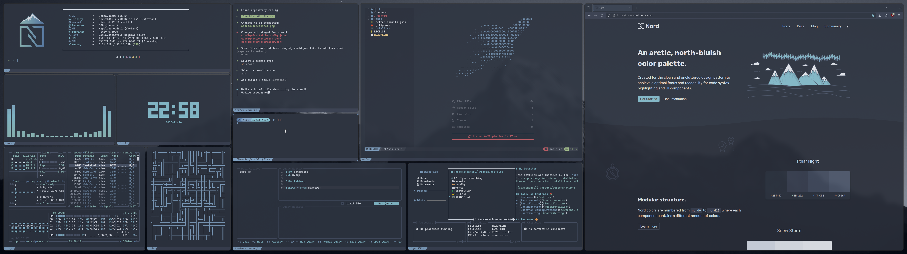

<div align="center">
  
</div>

# 🏔️ Nord Dotfiles

This dotfiles are inspired by the [Nord Theme](https://www.nordtheme.com/), and are designed to be simple and easy to use.  
This repository include an installation script which will help you to install the configurations you want.  




## Table of Contents 📚
- [Features](#features-)
- [Requirements](#requirements-)
- [Installation](#installation-)
- [Documentation](#documentation-)
- [External configurations](#external-configurations-)
- [Contributing](#contributing-)

## Features 🎨

| **Name**  | **Configuration Folder**                                                                          |
|-----------|---------------------------------------------------------------------------------------------------|
| btop++    | [Configuration Folder](https://github.com/a-lebailly/nord-dotfiles/tree/main/.config/btop)        |
| cava      | [Configuration Folder](https://github.com/a-lebailly/nord-dotfiles/tree/main/.config/cava)        |
| fastfetch | [Configuration Folder](https://github.com/a-lebailly/nord-dotfiles/tree/main/.config/fastfetch)   |
| harlequin | [Configuration Folder](https://github.com/a-lebailly/nord-dotfiles/tree/main/.config/harlequin)   |
| hypr      | [Configuration Folder](https://github.com/a-lebailly/nord-dotfiles/tree/main/.config/hypr)        |
| kitty     | [Configuration Folder](https://github.com/a-lebailly/nord-dotfiles/tree/main/.config/kitty)       |
| pipe.sh   | [See documentation](#documentation-)                                                              |
| rofi      | [Configuration Folder](https://github.com/a-lebailly/nord-dotfiles/tree/main/.config/rofi)        |
| posting   | [Configuration Folder](https://github.com/a-lebailly/nord-dotfiles/tree/main/.config/posting)     |
| starship  | [Configuration File](https://github.com/a-lebailly/nord-dotfiles/tree/main/.config/starship.toml) |
| superfile | [Configuration Folder](https://github.com/a-lebailly/nord-dotfiles/tree/main/.config/superfile)   |
| tty-clock | [See documentation](#documentation-)                                                              |
| waybar    | [Configuration Folder](https://github.com/a-lebailly/nord-dotfiles/tree/main/.config/waybar)      |

*You can find many others external configuration based on Nord Theme [here](#external-configurations-).*

## Requirements 📦
| **Name**  | **Sources**                                          | **Requirements**                                                                                                                                                                                   |
|-----------|------------------------------------------------------|----------------------------------------------------------------------------------------------------------------------------------------------------------------------------------------------------|
| btop++    | [GitHub](https://github.com/aristocratos/btop)       |                                                                                                                                                                                                    |
| cava      | [GitHub](https://github.com/karlstav/cava)           |                                                                                                                                                                                                    |
| fastfetch | [GitHub](https://github.com/fastfetch-cli/fastfetch) | [`./assets/images/nord-theme.png`](https://github.com/a-lebailly/nord-dotfiles/tree/main/assets/images/nord-theme.png)                                                                             |
| harlequin | [GitHub](https://github.com/tconbeer/harlequin)      |                                                                                                                                                                                                    |
| hypr      | [GitHub](https://github.com/hyprwm/Hyprland)         | [Breeze Cursor](https://github.com/KDE/breeze/tree/master/cursors/Breeze) and [`./assets/images/wallpaper.png`](https://github.com/a-lebailly/nord-dotfiles/tree/main/assets/images/wallpaper.png) |
| kitty     | [GitHub](https://github.com/kovidgoyal/kitty)        | [`./assets/fonts/CaskaydiaCoveNerdFont`](https://github.com/a-lebailly/nord-dotfiles/tree/main/assets/fonts/CaskaydiaCoveNerdFont)                                                                 |
| pipe.sh   | [GitHub](https://github.com/pipeseroni/pipes.sh)     | kitty and its [configuration](https://github.com/a-lebailly/nord-dotfiles/tree/main/.config/kitty/)                                                                                                |
| posting   | [GitHub](https://github.com/darrenburns/posting)     |                                                                                                                                                                                                    |
| rofi      | [GitHub](https://github.com/davatorium/rofi)         | [`./assets/fonts/UbuntuNerdFont`](https://github.com/a-lebailly/nord-dotfiles/tree/main/assets/fonts/UbuntuNerdFont)                                                                               |
| starship  | [GitHub](https://github.com/starship/starship)       |                                                                                                                                                                                                    |
| superfile | [GitHub](https://github.com/yorukot/superfile)       |                                                                                                                                                                                                    |
| tty-clock | [GitHub](https://github.com/xorg62/tty-clock)        | kitty and its [configuration](https://github.com/a-lebailly/nord-dotfiles/tree/main/.config/kitty/)                                                                                                |
| waybar    | [GitHub](https://github.com/Alexays/Waybar)          | [`./assets/fonts/UbuntuNerdFont`](https://github.com/a-lebailly/nord-dotfiles/tree/main/assets/fonts/UbuntuNerdFont)                                                                               |

## Installation 🚀
You can install the configurations using the automated installation script or manually.

### Clone the repository :
```bash
git clone https://github.com/a-lebailly/nord-dotfiles.git && cd dotfiles
```

### Copy the desired configurations files :
For example, if you want to install the `kitty` configuration, you can copy the configuration file to your home directory.
```bash
cp -r .config/kitty/ ~/.config/
```

## Documentation 📖
- **pipe.sh**: Execute `pipes.sh -p 5 -c 4 -f 100` or add this alias to your `.bashrc` or `.zshrc` file.
   ```bash
   echo alias pipesh="pipes.sh -p 5 -c 4 -f 100" > ~/.bashrc # or ~/.zshrc
   ```
- **rofi**: Execute `rofi -show drun -theme ~/.config/rofi/config.rasi` to open rofi and apply the style.
- **tty-clock**: Execute `tty-clock -c -C 6` or add this alias to your `.bashrc` or `.zshrc` file.
   ```bash
   echo alias clock="tty-clock -c -C 6" > ~/.bashrc # or ~/.zshrc
   ```

## External configurations 🌐

| Name       | Configuration URL                                                              |
|------------|--------------------------------------------------------------------------------|
| firefox    | [Configuration URL](https://addons.mozilla.org/fr/firefox/addon/nord-firefox/) |
| obsidian   | [Configuration URL](https://github.com/insanum/obsidian_nord)                  |
| vim/neovim | [Configuration URL](https://github.com/nordtheme/vim)                          |
| jetbrains  | [Configuration URL](https://plugins.jetbrains.com/plugin/10321-nord)           |
| vscode     | [Configuration URL](https://github.com/nordtheme/visual-studio-code)           |

*You can find more ports of the Nord Theme [here](https://www.nordtheme.com/ports).*

## Contributing 🤝
Feel free to contribute to this project by opening an issue or a pull request.  
Before any contribution, please check the Nord Theme color palette [here](https://www.nordtheme.com/docs/colors-and-palettes).
